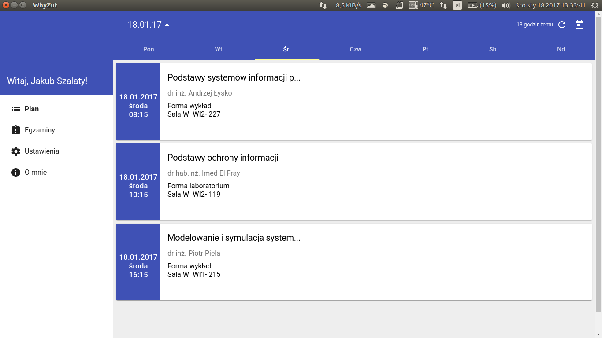
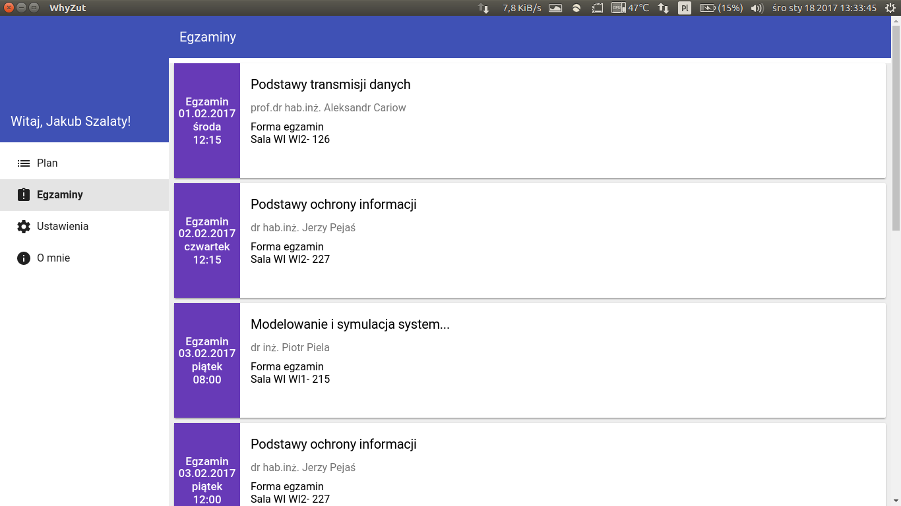
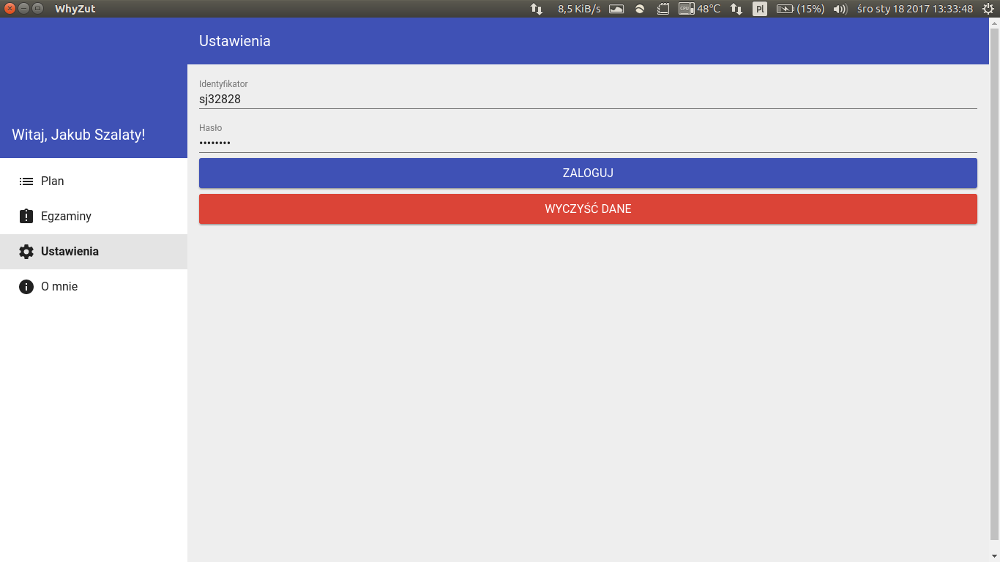
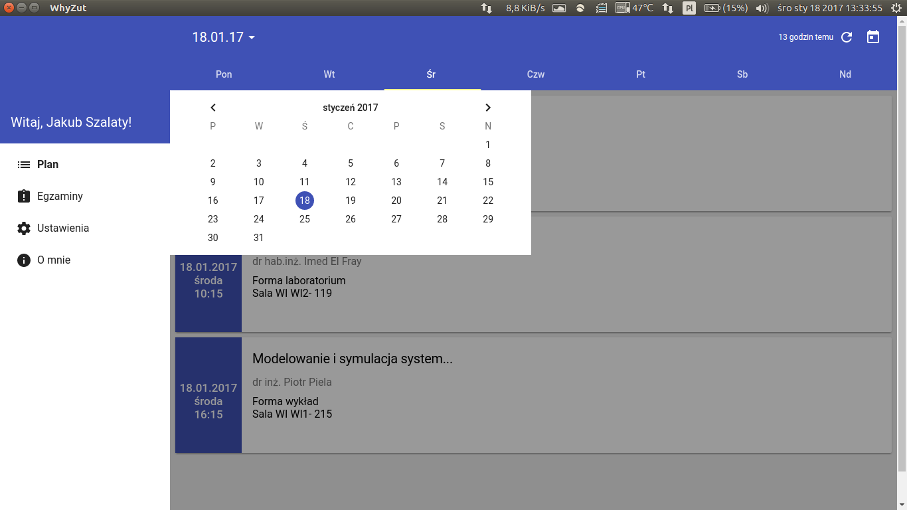

# whyzut-desktop
Desktop app for edziekanat.zut.edu.pl
[Link to download](https://drive.google.com/open?id=0Bw8hsJzinNm8MjhFbzlsb0JuNDA)

It's desktop version of [mobile app Whyzut](https://github.com/nnaisur/whyzut)

## Screens

<a href="./res/screens/screen1.png" target="_blank"></a>
<a href="./res/screens/screen2.png" target="_blank"></a>
<a href="./res/screens/screen3.png" target="_blank"></a>
<a href="./res/screens/screen4.png" target="_blank"></a>


## To Use

To clone and run this repository you'll need [Git](https://git-scm.com) and [Node.js](https://nodejs.org/en/download/) (which comes with [npm](http://npmjs.com)) installed on your computer. From your command line:

```bash
# Clone this repository
git clone https://github.com/nnaisur/whyzut-desktop
# Go into the repository
cd whyzut-desktop
# Install dependencies
npm install
# Run the app
electron .
```
